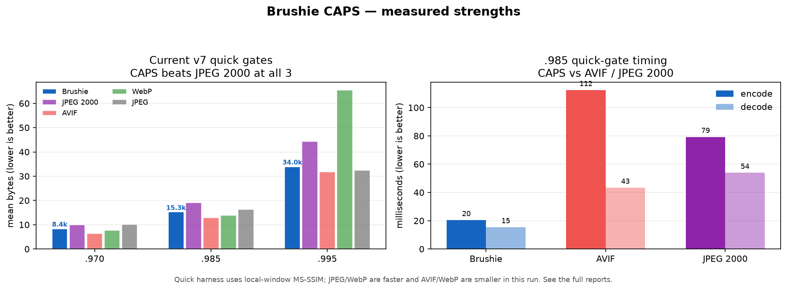

# Brushie CAPS

A from-scratch C++ image codec for compact, progressive image streams, built around a reversible YCoCg-R transform, a 5/3 lifting pyramid, adaptive Rice/rANS entropy coding, and deterministic CPU execution.



## What works

- Deterministic CPU encoder/decoder with a small C++ API and command-line tool
- Progressive coarse-to-fine streams and arbitrary-resolution decode
- RGB/RGBA input, lossless quality-100 mode, optional 4:2:0 chroma at lossy qualities
- Compact 16-byte chunk directory and v7 rANS payloads (older v1-v6 streams decode)
- Reproducible CMake build, CTest round-trip coverage, malformed-header checks, and fuzz tooling
- Strongest measured results are on the checked-in v7 quick local-MS-SSIM proxy: CAPS beats JPEG 2000 at all three gates and has a faster encode/decode path than AVIF and JPEG 2000 in that reference run

These are measured strengths, not a claim that Brushie is the best codec overall. On the checked-in SSIMULACRA2/Butteraugli landscape, JPEG XL, WebP, and AVIF are generally smaller at comparable perceptual gates.

## Quick start

```sh
cmake -S . -B build -DCMAKE_BUILD_TYPE=Release -DBUILD_TESTING=ON
cmake --build build -j8
ctest --test-dir build --output-on-failure

# PPM works without optional dependencies
build/brushie encode input.ppm output.brbr 82 8 32
build/brushie decode output.brbr output.ppm 4096 4096 -1
```

PNG input/output is available when CMake finds libpng. The CLI does not preserve PNG metadata or 16-bit samples.

## How it works

Brushie maps RGB into reversible YCoCg-R planes, decomposes them with a 5/3 wavelet pyramid, quantizes detail by frequency and quality, and codes whole-band symbols with causal significance/sign contexts and Rice magnitudes. Chunks are ordered coarse-to-fine so a decoder can stop after a physical prefix. Quality 100 uses the reversible transform without lossy chroma subsampling.

## Benchmarks

The figure above is generated from the checked-in v7 quick-harness aggregate:

```sh
MPLBACKEND=Agg uv run --with pandas --with matplotlib \
  python scripts/plot_readme_benchmarks.py
```

The left panel shows all codecs at the three local-window MS-SSIM proxy gates; Brushie beats JPEG 2000 at each gate. The right panel shows the .985 timing comparison against AVIF and JPEG 2000, where Brushie is faster. JPEG and WebP remain faster overall, and AVIF/WebP remain smaller. These proxy metrics are not a substitute for SSIMULACRA2, Butteraugli, or blinded human preference. See `campaign/landscape_real_metrics.md` for the complete real-metric comparison.

## License

[MIT](LICENSE)

## Build

```sh
cmake -S . -B build -DCMAKE_BUILD_TYPE=Release
cmake --build build -j8
ctest --test-dir build --output-on-failure
```

Where CMake is not installed, the equivalent build is:

```sh
mkdir -p build
clang++ -std=c++17 -O3 -ffast-math -Iinclude src/codec.cpp src/main.cpp -o build/brushie -pthread
# PNG I/O (optional): add -DBRUSHIE_HAVE_PNG and link libpng
```

## Tests

The canonical C++ test is built by CMake and run with CTest:

```sh
cmake -S . -B build -DCMAKE_BUILD_TYPE=Release -DBUILD_TESTING=ON
cmake --build build -j8
ctest --test-dir build --output-on-failure
```

Optional Python metric tests require NumPy (and Pillow for the broader benchmark scripts):

```sh
python3 tests/test_quality_metrics.py
python3 tests/test_enterprise_eval_helpers.py
```

## Use

The CLI reads and writes PPM, and PNG (RGB or RGBA) when built with libpng:

```sh
build/brushie encode input.ppm output.brbr 45 8 64
build/brushie decode output.brbr output.ppm 4096 4096 -1
```

RGBA PNGs round-trip losslessly at quality 100 (alpha is coded at full
resolution); at lossy qualities the alpha channel keeps hard edges.

`decode ... 0` emits the coarse LL layer only. `-1` emits every available
layer. The decoder may request any output width and height; it reconstructs
the needed pyramid prefix and bilinearly resamples.

Quality 1..100; 100 is exactly lossless (5/3 + YCoCg-R are reversible, chroma
is kept 4:4:4). Lower qualities use 4:2:0 chroma and progressively coarser
steps. One-pass analytical rate hints (the actual byte count is reported):

```sh
build/brushie encode input.ppm output.brbr --target-bytes 250000 --threads 8
build/brushie encode input.ppm output.brbr --target-lpips 0.06 --threads 8
```

`--target-lpips` is only a heuristic quality preset; no LPIPS model is
linked or evaluated by the deterministic CPU core, and the CLI labels the
result `target_lpips_unverified`. Do not treat it as an LPIPS target.

PNG support is optional and is enabled only when CMake finds libpng. A build without libpng is PPM-only; the no-CMake command below intentionally builds PPM-only. Input PNG metadata and 16-bit samples are not preserved by the optional CLI path.

For the Python metric tests, install Python 3 with NumPy (and Pillow for the broader evaluation scripts). The codec library and C++ round-trip test do not require Python.

## Enterprise evaluation

Harness v3 compares codecs at equal **local-window multiscale SSIM** gates
instead of unrelated quality settings or the retired global-moment proxy. It
uses exhaustive integer quality sweeps, strong JPEG/WebP modes, still-image
AVIF, honest full-coverage aggregation, reproducibility manifests, and actual
truncated progressive streams. The full run includes Kodak plus available
DIV2K validation sources and a `native_expanded` max-1536 profile (sources are
not upscaled).

```sh
python3 scripts/enterprise_eval.py --quick
python3 scripts/enterprise_eval.py --output-prefix harness_v3_full
```

The harness writes candidate, matched-quality, aggregate, progressive, and
preview CSVs plus a Markdown decision report. The current commercial
go/no-go assessment is in [enterprise_readiness.md](enterprise_readiness.md).
